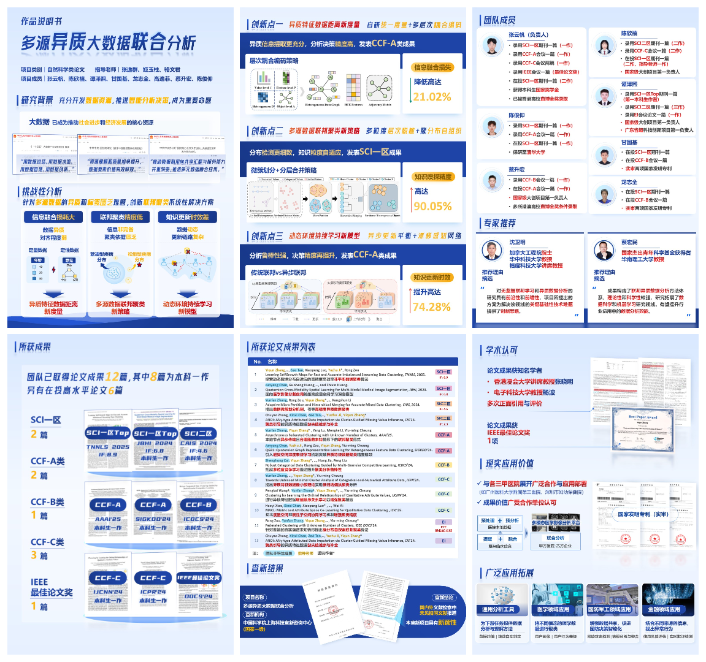

## 📸 Project Gallery

**Project Title:** Federated Analysis of Multi-source Heterogeneous Big Data（多源异质大数据联合分析）

**Competition:** 2025 "Challenge Cup" National Undergraduate Academic Science and Technology Competition 

**Track:** Academic Paper Track

**Award:** 🏆 Provincial Grand Prize & National Third Prize 

---

Here is a **visual summary** of our project, highlighting the **core methodology**, **competition poster**, and **documentation cover design**.

> 📂 **Note:**  For the detailed materials, please refer to the **[`/docs`](./docs)** directory.

<!-- 1. PPT 拼图：展示核心思路 -->

### 1. Methodology & Highlights (Slides)
<!-- 你的PPT拼图放在这里 -->

  
  
<em>Key slides illustrating the background, framework, innovative methods, and project outcomes.</em>

---

<!-- 2. 现场展板：展示比赛实况 -->
### 2. Competition Showcase (On-site Poster)
<!-- 你的现场展板照片放在这里 -->

  
  
<em>Presentation at the Provincial Grand Prize Defense.</em>

---

<!-- 3. 作品书拼图：展示工作量 -->
### 3. Technical Documentation
<!-- 你的作品书拼图放在这里 -->

  
  
<em>Cover design and layout overview of the technical proposal.</em>

  <!-- 说明文字 -->
  

    <strong>📄 Full Report (Optional):</strong> 
    This file includes the competition poster, followed by our full research papers. 
    <small>
      (Note: The PDF is large and <strong>cannot be rendered</strong> in the browser. Please download it if you wish to view all details.)
    </small>
  

  <!-- 下载按钮 -->
  

    <!-- 记得检查文件名是否已经改成了下划线版本 -->
    <a href="./docs/Research_Report.pdf">
      <strong>[📥 Download Full PDF (86.4MB)]</strong>
    </a>
  

